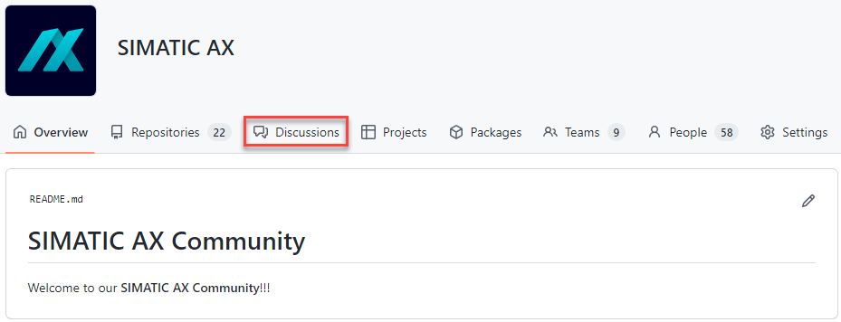
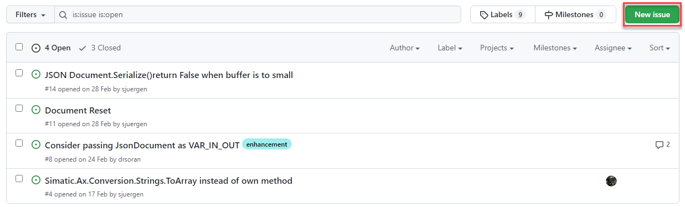

# Contributing to SIMATIC AX Community

Welcome, and thank you for your interest in the SIMATIC AX Community

There are many ways in which you can contribute, beyond writing code. The goal of this document is to provide an overview of how you can get involved.

## Discussions
Discussions are project wide and function like a typical forum.

Here you can post:

- questions
- answers 
- feedback
- (topic) suggestions
- etc

about the product or community.

Please use [SIMATIC AX Discussions](https://github.com/orgs/simatic-ax/discussions)

It should look like this: 

1. Open GitHub discussion
   

2. Select a category

    

3. Submit your question, feedback or idea

## Reporting issues
Issues are repository specific and like bug reports for the content of the repository.

- Is your library or application example not working as described?
- Do you have a feature request or an idea?

Feel free to report an issue direct in the related repository.

1. Select the related repository
    

2. Create a new issue

    

3. Select one of the provided issue types

    

## Thank You

Your contributions to this open source project - large or small - let´s us create better automation solutions - together! Thank you for beeing a essential part of this journey.
