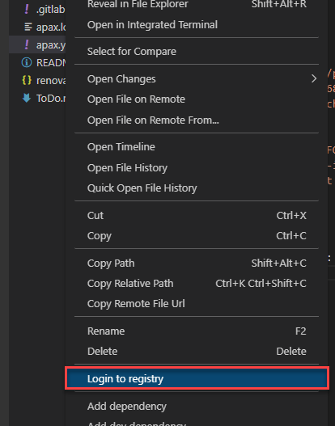
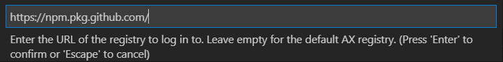
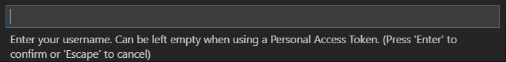
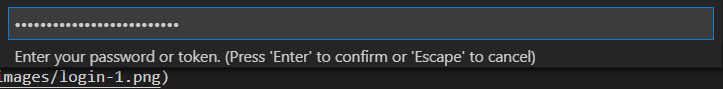

# Personal access token for the GitHub registry

## Table of contents

- [Purpose for personal access token](#purpose-for-personal-access-token)
- [Create a personal access token on GitHub](#create-a-personal-access-token-on-github)
- [Login into Simatic-Ax registry](#login-into-simatic-ax-registry)
    - [Login via CLI](#login-via-cli)
    - [Login via AX Code UI (Web or local IDE)](#login-via-ax-code-ui-web-or-local-ide)
- [Workspace settings to access the GitHub registry](#workspace-settings-to-access-the-github-registry)

## Purpose for personal access token

To be able to consume packages from the `simatic-ax` group, you need to login to the registry.

## Create a personal access token on GitHub

To create a personal access token on GitHub, follow this [link](https://docs.github.com/en/authentication/keeping-your-account-and-data-secure/managing-your-personal-access-tokens#creating-a-personal-access-token-classic)

> It's ***very*** important that you check the checkbox `write:packages`
>
> 
>
> For security reasons, your token should expire after a while (by default it's 30 days).
> Remember this token. You'll need it for the login in the next step.

## Login to Simatic-AX registry

### Login via CLI

To login via CLI, you need to enter the following command. You need to replace `<your personal access token>` with your GitHub-created access token.

```cli
apax login --registry https://npm.pkg.github.com/ --password <your personal access token>
```

### Login via AX Code UI (Web or local IDE)

To login to the GitHub registry for Simatic AX within your IDE (Web or local AX Code), follow these steps:

1. Select the file `apax.yml`, right-click and select `Login to registry`

      

1. Enter the GitHub URL

       

    ```url
    https://npm.pkg.github.com/
    ```

1. Leave the user name field empty and press `Enter`

      

1. Enter your personal access token from GitHub with `Ctrl+V`

      

Now you're able to install all dependencies to develop your library.

## Workspace settings to access the GitHub registry

To access the GitHub registry from your workspace, you need to declare it in the apax.yml.

Please enter the following code into your apax.yml:

```yml
registries:
  '@simatic-ax': 'https://npm.pkg.github.com/'
```
