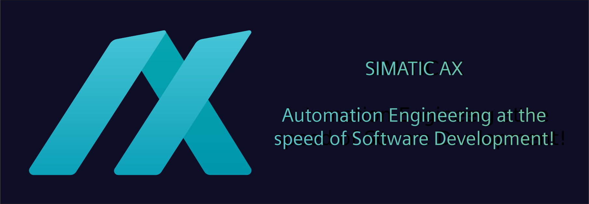

# SIMATIC AX Community

## Table of Contents
- [About Us](#about-us)
- [Community Resources](#community-resources)
- [Contributing](#contributing)
- [Stay Informed](#stay-informed)
- [Using Packages](#using-packages)
- [Other Siemens Projects](#other-siemens-projects)

## About Us
We believe that collaboration helps everybody to create better products and services, which ultimately makes our world a better place. We made it our mission to provide you with such a space to grow together. **This space is here!**

The community is actively maintained by the [SIMATIC AX GitHub community admins](https://github.com/orgs/simatic-ax/teams/toa-teamofaxion). Feel free to contact us in case of questions.

## Community Resources
The SIMATIC AX Open Source Community is a platform where you can find useful ST examples for SIMATIC AX:

- **[Application Examples](/docs/overview/appl-example.md)** - Ready-to-use applications for SIMATIC AX
- **[Example Libraries](/docs/overview/example-libraries.md)** - Libraries for use in your own projects
- **[Tutorials](/docs/overview/tutorials.md)** - Self-study materials
- **[Code Snippets](/docs/overview/code-snippets.md)** - Reusable code components
- **[Project Templates](/docs/overview/templates.md)** - Templates for quick project setup

## Contributing
Thanks for your interest in contributing to the community! We suggest you read our [contributing guidelines](/CONTRIBUTING.md).

## Stay Informed

You may stay informed about the activities inside the community by checking out the [SIMATIC AX discussions](https://github.com/orgs/simatic-ax/discussions). In case you don't want to miss out on any new content created here, you may subscribe to the activities in the [discussions repository](https://github.com/simatic-ax/.discussions) by enabling `Watch` --> `All Activity`

<details><summary>Show screenshot ... </summary>


</details>

> This also works for other repositories you're interested in

## Using packages in your projects

If you want to use packages from the "@simatic-ax" community scope in your SIMATIC AX projects, you have to login to the GitHub container registry using a personal access token. How to do this is explained in detail [here](/docs/personalaccesstoken.md).  

Just add the following registry to your apax.yml file, login with apax and start exploring our community packages. 
```yml
registries:
  "@simatic-ax": "https://npm.pkg.github.com/"
```  

When installing packages from 3rd party locations (other than the "@ax" product registry) it is always advised to validate package signatures. Add the following key in the "publicKey" section of your apax.yml.  

```yml
publicKeys:
  "@simatic-ax": "3792a7e926775425ccdd29ceed8c368c3008b5b33d7d5550b3cb1f58093e1dff"
```  

## Other Siemens Projects
Discover more Siemens [open source projects](https://opensource.siemens.com):

[](https://github.com/siemens)
[](https://github.com/industrial-edge)
[](https://github.com/mindsphere)
[](https://github.com/mendix)
[](https://github.com/SIMATICmeetsLinux)
[](https://github.com/tia-portal-applications)